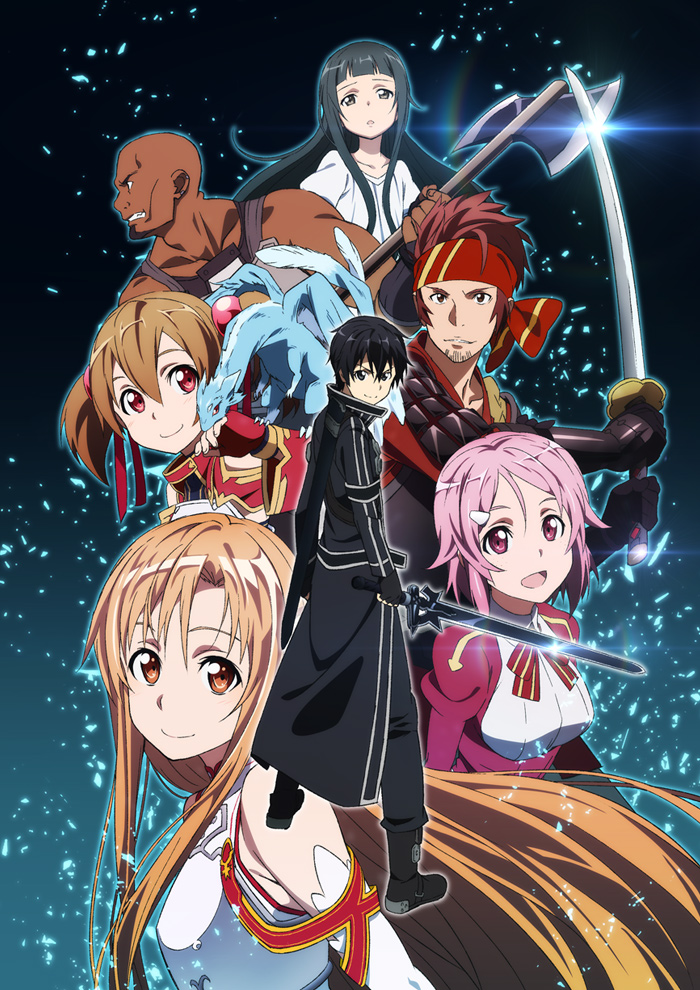
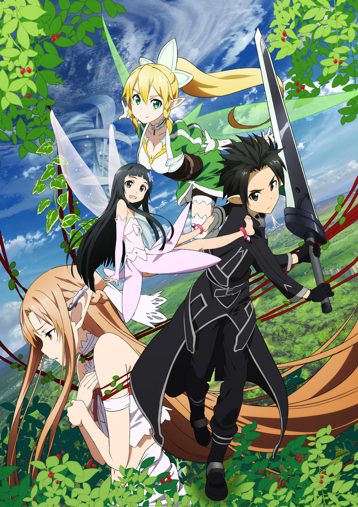
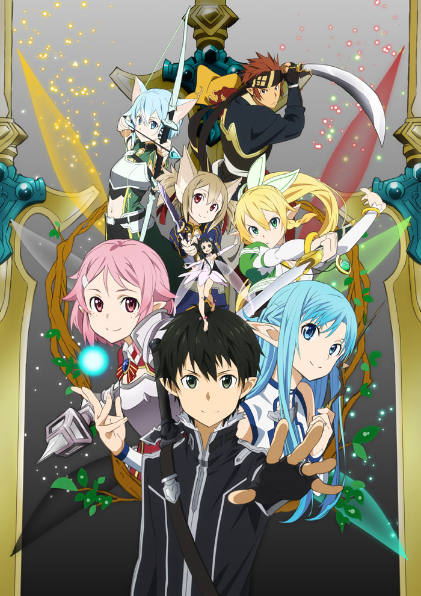
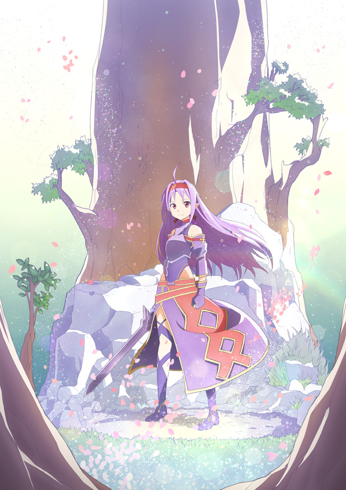
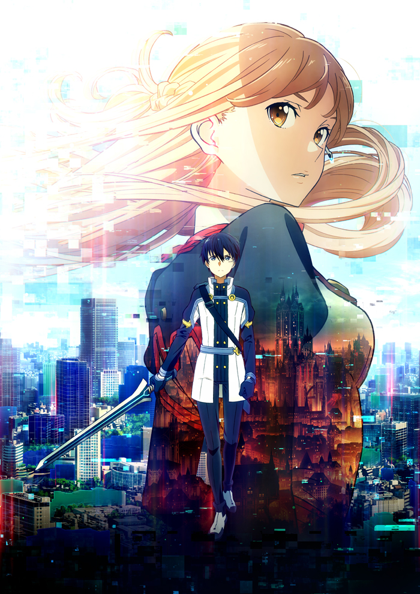
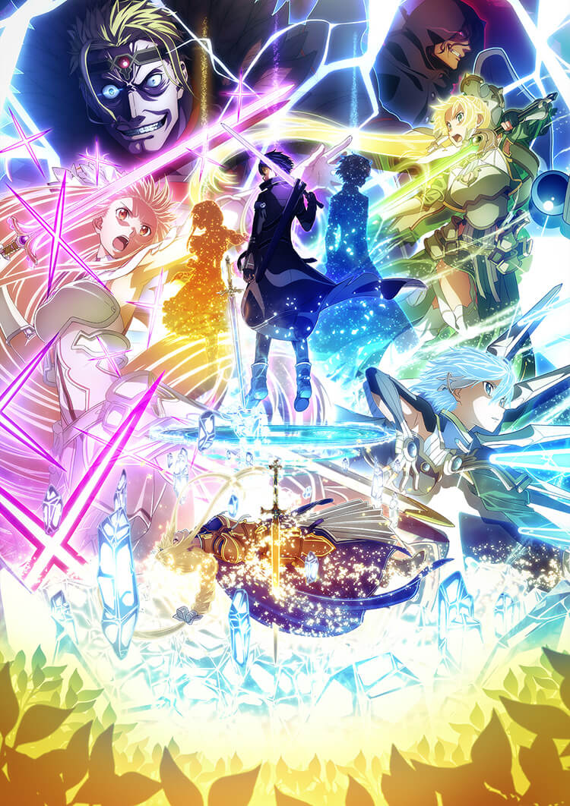
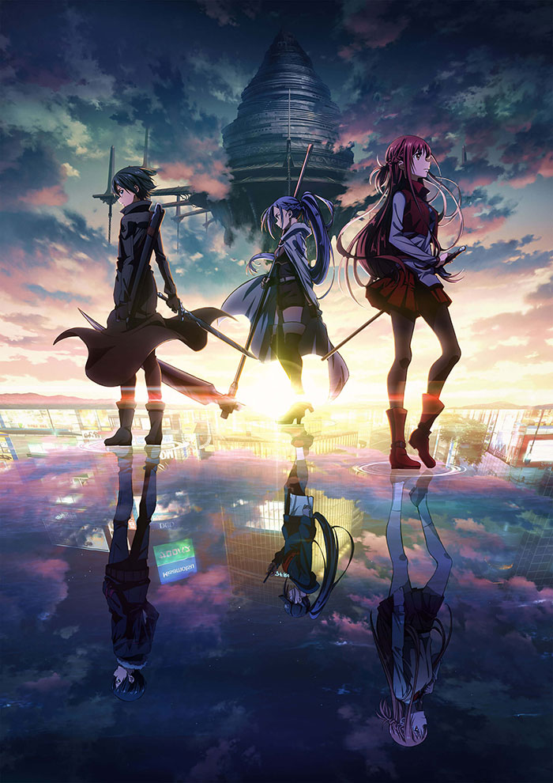

### Hi there! I am a CS student from China!

<!--   -->

I entered Mixed Class of [Chu Kochen honors college](http://ckc.zju.edu.cn/), [Zhejiang University](https://www.zju.edu.cn/) in 2018. My major is computer science and my interests include computer grahics, computer vision, game programming and deep learning. I am currently working on appearance modeling and deep learning topics with Prof. [Hongzhi Wu](http://www.cad.zju.edu.cn/home/hwu/).

Plus, I am big fan of Japanese ACG culture. Following are pictures taken from *`Sword Art Online`*, one of my favourite animations.

  
  
  
  
  
  
  

